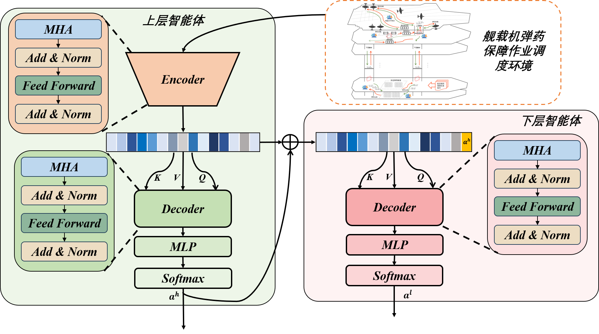

# Job_Shop_Scheduling

a two-stage hierarchical RL method framework of a variant of the job shop scheduling problem

## RL

an adaptive time window schedule and a rule schedule 

run on PyTorch 2.4.1 and Python 3.9


该方法基于分层强化学习范式，构建双层智能网络以优化弹药实时保障过程：上层智能体通过动态调整时间窗，根据系统当前状态自适应设置灵活窗口；下层智能体基于预定规则，自适应选择最优匹配策略，实现有限资源的合理分配。具体而言，上层智能体首先综合分析实时弹药保障态势和弹药保障机床运行状态，精准选择时间窗大小。通过将该时间窗内空闲弹药的决策信息传递至下层智能体，下层智能体将为空闲弹药选择最适合的启发式匹配规则，从而实现弹药保障的动态优化和资源高效利用。


针对舰载机弹药保障的复杂动态环境，本文引入分层强化学习策略，将整个弹药保障系统建模为两个马尔可夫决策过程（Hierarchical Markov Decision Process）。具体而言，系统定义为 $(MDP^l, MDP^h)$，其中高层智能体 $MDP^h = (\mathcal{S}^h, \mathcal{A}^h, \mathcal{R}^h, \mathcal{P}^h, \gamma^h)$，低层智能体 $MDP^l = (\mathcal{S}^l, \mathcal{A}^l, \mathcal{R}^l, \mathcal{P}^l, \gamma^l)$，均由状态空间 $\mathcal{S}$、动作空间 $\mathcal{A}$、奖励函数 $\mathcal{R}$、状态转移函数 $\mathcal{P}$ 和奖励折扣因子 $\gamma$ 五元组构成。具体定义如下：

### 时间窗划分层 MDP

**$\mathcal{S}^h$（高层状态）**：状态 $s_i^h \in \mathcal{S}^h$ 表示第 $i$ 个决策步下高层智能体的全局状态。状态 $s_i^h$ 可以使用三元组表示，即 $s_i^h = (D, D^w, O)$，其中：

- $D$ 表示所有弹药的基本状态，使用一组二维向量组表示为 $[[x_1^1, \dots, x_n^1], \dots, [x_1^m, \dots, x_n^m]]$，其中 $x_n^m$ 表示第 $m$ 层，第 $n$ 类弹药的数量；
- $D^w$ 表示未进行保障的弹药状态，也使用相同的二维向量组表示；
- $O$ 表示所有保障设备的状态，使用二维向量组 $[[y_1^1, \dots, y_k^1], \dots, [y_1^m, \dots, y_z^m]]$ 表示，其中 $y_k^m \in \{0, 1\}$，$0$ 表示设备空闲，$1$ 表示设备忙碌。

其他辅助变量包括：

- $L$：各阶段当前等待调度的车次弹药数量；
- $R$：各阶段空闲的机器数量；
- $A$：各阶段下一个车次弹药的到达时间；
- $h$：距离上次划分时间窗的时间。

**$\mathcal{A}^h$（高层动作）**：高层动作 $a_i^h \in \mathcal{A}^h$ 表示第 $i$ 个决策步骤中高层智能体的动作。其动作空间定义为 $[t_{min}, t_{max}]$，即高层动作限定在该时间窗范围内的整数值。

**$\mathcal{R}^h$（高层奖励）**：高层奖励 $r_i^h \in \mathcal{R}^h$ 用于评估高层动作 $a_i^h$ 对全局效益的影响。该奖励通过聚合低层奖励来量化高层决策的整体效果，体现其对全局目标的优化能力。本文设计了一种独特的奖励层次机制，融合下层智能体信息，具体设计将在后文详细阐述。

**$\mathcal{P}^h$（状态转移函数）**：$\mathcal{P}(S_{t+1} \mid S_t, A_t)$ 描述在状态 $S_t$ 下执行动作 $A_t$ 后，转移到下一个状态 $S_{t+1}$ 的概率分布。

**$\gamma^h$（折扣因子）**：折扣因子 $\gamma \in [0, 1]$ 表示智能体对未来奖励的关注程度。

---

### 规则匹配层 MDP

**$\mathcal{S}^l$（低层状态）**：状态 $s_i^l \in \mathcal{S}^l$ 表示第 $i$ 个决策步下低层智能体的状态，可表示为四元组 $s_i^l = (D, D, O, a^h)$，其中 $D, D, O$ 与高层状态一致，$a^h$ 为高层智能体在该步骤中的动作。

**$\mathcal{A}^l$（低层动作）**：低层动作 $a_i^l \in \mathcal{A}^l$ 表示第 $i$ 个决策步骤中低层智能体的动作，具体为选择某种启发式规则进行匹配。

**$\mathcal{R}^l$（低层奖励）**：低层奖励 $r_i^l \in \mathcal{R}^l$ 用于衡量低层动作 $a_i^l$ 的效果，其定义如下：

$$
r_i^l = \max_j(C_j)_{i-1} - \max_j(C_j)_i
$$

即上一个决策步中的最长完成时间减去当前的最长完成时间。

**$\mathcal{P}^l$（状态转移函数）**：$\mathcal{P}(S_{t+1} \mid S_t, A_t)$ 描述状态 $S_t$ 执行动作 $A_t$ 后转移至状态 $S_{t+1}$ 的概率分布。

**$\gamma^l$（折扣因子）**：折扣因子 $\gamma \in [0, 1]$ 表示智能体对未来奖励的关注程度。


本小节主要讲述上层智能体的主要构建方式，如图所示，上层智能体参考Transformer，由编码器和解码器的的组件构成，其中，编码器的主要功能是处理弹药保障信息，通过对舰载机弹药种类、数量以及保障状态的综合分析，将这些原始数据转化为可用于后续计算的隐变量嵌入（embedding）。解码器的主要功能是根据输入的隐变量嵌入（embedding），通过对其进行处理和解码，输出相应的时间窗大小。通过这种方式，解码器则负责根据编码器生成的隐变量嵌入，对其进行进一步处理和解码，最终输出与任务时间窗大小相关的决策信息，以优化调度过程。编码器和解码器在结构上具有较高的一致性，主要由多头注意力机制（Multi-Head Attention, MHA），残差连接及归一化（Add \& Norm），前馈神经网络（Feed Forward）组成，我们以编码器为示例介绍嵌入传递过程，编码器由$L_1$个相同的注意力层的堆叠组成, 每一个注意力层由多头注意力层和前馈神经网络层(Feed Forward)组成, 每个操作后都会进行残差连接和归一化(add＆norm), 嵌入在模型中更新遵循两步过程。


在规则调度层智能体中，动作空间由一组预定义的调度规则组成，每条规则对应一种调度策略。规则调度层智能体通过选择这些规则，动态调整任务的执行顺序，以优化系统性能指标。

## 时间窗划分层

本小节主要讲述上层智能体的主要构建方式。上层智能体参考 Transformer，由编码器和解码器的组件构成。

其中，编码器的主要功能是处理弹药保障信息，通过对舰载机弹药种类、数量以及保障状态的综合分析，将这些原始数据转化为可用于后续计算的隐变量嵌入（embedding）。

解码器的主要功能是根据输入的隐变量嵌入，通过对其进行处理和解码，输出相应的时间窗大小。通过这种方式，解码器则负责根据编码器生成的嵌入，对其进行进一步处理和解码，最终输出与任务时间窗大小相关的决策信息，以优化调度过程。

编码器和解码器在结构上具有较高的一致性，主要由多头注意力机制（Multi-Head Attention, MHA）、残差连接及归一化（Add & Norm）、前馈神经网络（Feed Forward）组成。我们以编码器为示例介绍嵌入传递过程，编码器由 $L_1$ 个相同的注意力层堆叠组成。每一个注意力层由多头注意力层和前馈神经网络层组成，每个操作后都会进行残差连接和归一化（Add & Norm），嵌入在模型中更新遵循两步过程。

首先是多头注意力机制嵌入。更新输入的嵌入 $x_i^{\ell-1}$ 通过 MHA 提取上下文关系，输出结果与原始嵌入相加后，经过归一化操作得到中间结构 $\hat{x}_i$。通过对所有输入嵌入建模，MHA 能够高效捕捉当前弹药转运作业环境的状态属性的交互关系：

$$
\hat{x}_i = BN^\ell\left(x_i^{\ell-1} + MHA_i^\ell(x_1^{\ell-1}, x_2^{\ell-1}, \dots, x_{|p|}^{\ell-1})\right)
$$

接着是前馈神经网络嵌入更新，上一步得到的中间结果 $\hat{x}_i$，通过前馈神经网络层进一步提取高维特征，与 $\hat{x}_i$ 相加并归一化后得到最终输出 $x_i^\ell$，进一步丰富其语义信息：

$$
x_i^\ell = BN^\ell\left(\hat{x}_i + FF^\ell(\hat{x}_i)\right)
$$

上述式子中的核心是多头注意力层，其具体过程如下。编码器中的 MHA 将输入嵌入 $x_i$ 通过权重矩阵生成查询（Query）、键（Key）和值（Value）向量：

$$
Q_i^h = W_Q^h \cdot x_i,\quad K_i^h = W_K^h \cdot x_i,\quad V_i^h = W_V^h \cdot x_i
$$

Q 和 K 向量通过点积计算相似性，并结合 V 向量生成加权输出：

$$
A_i^h = \text{softmax}\left(\frac{Q_i^h \cdot K_i^h}{\sqrt{d_k}}\right) \cdot V_i^h
$$

最终，所有注意力头的输出拼接后通过线性变换得到多头注意力的输出：

$$
MHA_i = \text{concat}(A_i^1, A_i^2, \dots) \cdot W_o
$$

其中 $h = 1, 2, \dots, H$，$H$ 是注意力头的数量，$W_Q^h$, $W_K^h$, $W_V^h$ 是 $Q$, $K$, $V$ 的权重，$W_o$ 是 MHA 的输出权重，$d_k$ 是单头的特征维度，其公式为：

$$
d_k = \frac{d_x}{H}
$$

上层智能体解码器的任务是将编码器生成的隐变量嵌入转化为时间窗划分的具体决策，其结构和编码器类似，由 MHA、FF、残差连接和归一化组成。

解码器在处理嵌入时，采用与编码器类似的公式更新嵌入表示，并通过 MLP 层和 softmax 层输出各时间窗选择的概率：

$$
\text{TimeWindows} = \arg\max(\text{softmax}(\text{MLP}(x_i)))
$$

最终通过编码器和解码器的协作实现时间窗划分任务的高效建模。编码器负责提取弹药保障信息的上下文特征，解码器根据提取的信息生成时间窗划分的最优决策。结合多头注意力机制的高效建模能力，上层智能体为弹药保障调度提供了智能化的时间窗划分方案，显著提升了任务的执行效率和响应能力。

---

## 规则匹配层

### 网络结构

规则调度层和时间窗层有相同的网络结构。

### 调度规则

在规则调度层智能体中，动作空间由一组预定义的调度规则组成，每条规则对应一种调度策略。规则调度层智能体通过选择这些规则，动态调整任务的执行顺序，以优化系统性能指标。具体而言，我们定义以下几种常用的调度规则作为动作空间的候选项：

1. **最短加工时间优先（Shortest Processing Time, SPT）**  
   优先选择加工时间最短的任务进行调度。

2. **最早到期时间优先（Earliest Due Date, EDD）**  
   优先选择任务到期时间最早的任务进行处理。

3. **最大剩余工作量优先（Maximum Remaining Work, MRW）**  
   优先选择剩余工作量最大的任务进行调度。

4. **最小开始时间优先（Minimum Start Time, MST）**  

## 模型训练

### 奖励链接

本文对上下两层智能体构建了独特的奖励链接机制，其中下层奖励为上个决策步中的最长完成时间减去当前最长完整完成时间，即：

$$
r^l_i = \max_j(C_j)_{i-1} - \max_j(C_j)_i
$$

根据下层智能体选择各个调度规则的可能性对最长完成时间进行加权求和，作为上层智能体的奖励，计算方式如下：

$$
r^h_i = \sum p(a^l_j) \cdot \left[\max_j(C_j)_{i-1} - \max_j(C_j)_i \right]
$$

### 模型训练

针对本文提出的分层强化学习框架（框架名称），本小节介绍该框架的训练方法。本文以 PPO 算法为例，阐述（框架名称）的训练过程。

> 🚩 *注意：此处需体现上下层的联合交互训练，即突出“联合”训练的过程。*

HRL-ADAS算法的伪代码如下所示：

```python
# HRL-ADAS算法伪代码

# Input: 环境 E, 策略网络 π_θ, 价值网络 V_φ, 学习率 α,
# 剪切参数 ε, 折扣因子 γ, 训练轮数 K, 批大小 B, 每次更新步数 T

# Output: 最优调度方案

Initialize policy network parameters θ, value function parameters φ

for iteration i = 1, 2, ... do:
    Initialize empty trajectory buffer D = ∅

    for episode j = 1, 2, ..., N do:
        s₀ = E.reset()
        for timestep t = 0, 1, ..., T do:
            a_t ∼ π_θ(a_t | s_t)
            s_{t+1}, r_t = E.step(a_t)
            D ← D ∪ (s_t, a_t, r_t, s_{t+1})
            if done or t == T:
                break

    Compute advantages Â_t and returns R_t for each (s, a, r, s') in D
    Normalize advantages: Â_t ← (Â_t − μ) / σ

    for epoch k = 1, 2, ..., K do:
        Shuffle D into mini-batches
        for each mini-batch b in D do:
            Compute ratio:
                r_t(θ) = π_θ(a_t|s_t) / π_θ_old(a_t|s_t)
            Compute surrogate loss:
                L^CLIP(θ) = E[min(r_t(θ)Â_t, clip(r_t(θ), 1−ε, 1+ε)Â_t)]
            Compute value loss:
                L^{VF}(φ) = E[(V_φ(s_t) − R_t)^2]
            Update θ: θ ← θ − α ∇_θ L
            Optionally update φ: φ ← φ − α ∇_φ L^{VF}
```

> 📝 公式中的 `π_θ` 是策略网络，`V_φ` 是价值网络，`Â_t` 是优势函数，`R_t` 是回报。
